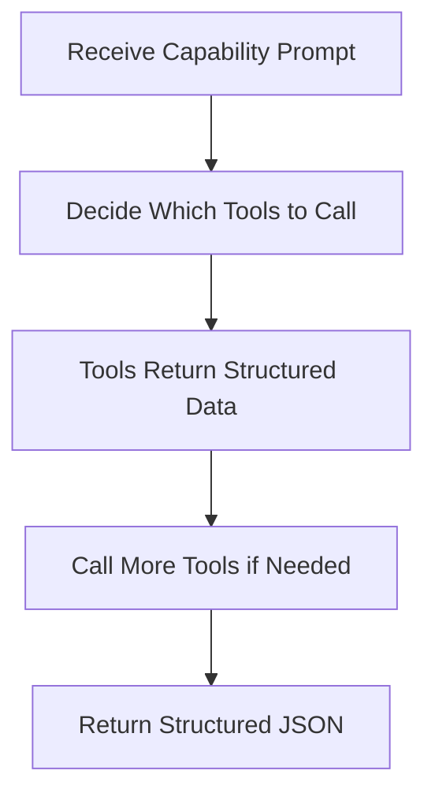

# Iris Agent System

The Iris Agent is the core intelligence of Git-Iris, built on [rig-core 0.37](https://docs.rs/rig-core/0.37.0) (imported as `rig` via `package = "rig-core"` in `Cargo.toml`) for agentic workflows.

**Source:** `src/agents/iris.rs`

## Design Philosophy

### One Agent to Rule Them All

Git-Iris uses a **unified agent architecture** with capability switching:

```rust
pub struct IrisAgent {
    provider: String,              // "openai", "anthropic", "google"
    model: String,                 // Primary model for complex tasks
    fast_model: Option<String>,    // Fast model for subagents
    current_capability: Option<String>, // Active capability
    provider_config: HashMap<String, String>,
    preamble: Option<String>,
    config: Option<Config>,
    content_update_sender: Option<ContentUpdateSender>,
}
```

**Benefits:**

- **Code reuse** — Tools, validation, and execution logic shared across all capabilities
- **Consistency** — Same decision-making process for commits, reviews, PRs, etc.
- **Maintainability** — Fix a bug once, it's fixed everywhere
- **Testability** — Test one agent with different prompts

### Stateless and Send-Safe

`IrisAgent` doesn't store any rig clients. Each call to `build_agent` constructs a fresh provider client through `provider::openai_builder`, `provider::anthropic_builder`, or `provider::gemini_builder`, then returns a `DynAgent` enum wrapping the provider-specific `Agent<M>`. This design:

- Reads API keys from environment (or config) at call time via `resolve_api_key`
- Allows the agent to be used across async boundaries (`tokio::spawn`)
- Makes the agent `Send + Sync` safe

## Agent Lifecycle

### 1. Creation

```rust
// Direct creation
let agent = IrisAgent::new("anthropic", "claude-opus-4-6")?;

// With builder
let agent = IrisAgentBuilder::new()
    .with_provider("anthropic")
    .with_model("claude-opus-4-6")
    .with_preamble("Custom instructions...")
    .build()?;
```

### 2. Configuration

Agents can be configured with:

- **Fast model** for subagents: `agent.set_fast_model("gpt-5.4-mini")`
- **Config** for gitmoji/presets: `agent.set_config(config)`
- **Content update sender** for Studio chat mode: `agent.set_content_update_sender(sender)`

### 3. Execution

```rust
let response = agent.execute_task("commit", "Generate a commit message").await?;

match response {
    StructuredResponse::CommitMessage(msg) => {
        println!("{} {}", msg.emoji.unwrap_or_default(), msg.title);
    }
    _ => {}
}
```

### 4. Streaming (for TUI)

```rust
agent.execute_task_streaming("review", prompt, |chunk, aggregated| {
    // Update TUI with each text chunk
    print!("{}", chunk);
}).await?;
```

## Tool Attachment

Tools are attached when the agent is built. `build_agent` returns a `DynAgent` enum and dispatches on the configured provider string:

```rust
fn build_agent(&self) -> Result<DynAgent> {
    let preamble = self.preamble.as_deref().unwrap_or(DEFAULT_PREAMBLE);
    let fast_model = self.effective_fast_model();
    let api_key = self.get_api_key();
    let subagent_timeout = self.config.as_ref().map_or(120, |c| c.subagent_timeout_secs);
    let subagent_max_turns = self.config.as_ref().map_or(20, |c| c.subagent_max_turns);

    // ... macros build subagent, attach main tools, optionally add update tools ...

    match self.provider.as_str() {
        "openai" => {
            let sub_agent = build_subagent!(provider::openai_builder(fast_model, api_key)?);
            let builder = provider::openai_builder(&self.model, api_key)?.preamble(preamble);
            let builder = self.apply_completion_params(builder, &self.model, 16384, CompletionProfile::MainAgent)?;
            let builder = attach_main_tools!(builder).tool(sub_agent);
            let agent = maybe_attach_update_tools!(builder);
            Ok(DynAgent::OpenAI(agent))
        }
        "anthropic" => { /* mirror of OpenAI arm using anthropic_builder */ }
        "google" | "gemini" => { /* mirror using gemini_builder */ }
        _ => Err(anyhow::anyhow!("Unsupported provider: {}", self.provider)),
    }
}
```

Each arm:

1. Builds a subagent with `attach_core_tools!` (no delegation tools).
2. Builds the main agent with `attach_core_tools!` plus `GitRepoInfo`, `Workspace`, and `ParallelAnalyze::with_limits` (configured with `subagent_timeout` and `subagent_max_turns`).
3. Conditionally attaches `UpdateCommitTool`, `UpdatePRTool`, and `UpdateReviewTool` when a `content_update_sender` is present (Studio chat mode).
4. Wraps the resulting `Agent<M>` in the appropriate `DynAgent` variant.

`apply_completion_params` keeps provider quirks out of the main builder flow. For OpenAI GPT-5 models, it injects the right completion-token parameter and a default reasoning profile (`medium` for the main agent unless the user explicitly overrides `reasoning`). For Anthropic, `anthropic_agent_builder` adds `.with_automatic_caching()` unconditionally so multi-turn tool loops bill prior turns at the cached rate.

### Tool Registry Pattern

The `attach_core_tools!` macro ensures consistency. It wires **eleven** core tools — every Git source of evidence, file/code access, repository orientation, linter execution, and project documentation:

```rust
#[macro_export]
macro_rules! attach_core_tools {
    ($builder:expr) => {{
        use $crate::agents::debug_tool::DebugTool;
        use $crate::agents::tools::{
            CodeSearch, FileRead, GitBlame, GitChangedFiles, GitDiff, GitLog, GitShow, GitStatus,
            ProjectDocs, RepoMapTool, StaticAnalysis,
        };

        $builder
            .tool(DebugTool::new(GitStatus))
            .tool(DebugTool::new(GitDiff))
            .tool(DebugTool::new(GitLog))
            .tool(DebugTool::new(GitShow))
            .tool(DebugTool::new(GitChangedFiles))
            .tool(DebugTool::new(GitBlame))
            .tool(DebugTool::new(FileRead))
            .tool(DebugTool::new(CodeSearch))
            .tool(DebugTool::new(RepoMapTool))
            .tool(DebugTool::new(StaticAnalysis))
            .tool(DebugTool::new(ProjectDocs))
    }};
}
```

The companion `CORE_TOOLS: &[&str]` constant in `src/agents/tools/registry.rs` lists the same eleven names, and a unit test asserts the count stays at 11.

**Prevents drift** — Main agents and subagents always have the same core tools. Delegation tools (`Workspace`, `ParallelAnalyze`, the sub-agent itself) are attached only to the main agent so subagents can't recurse.

## Multi-Turn Execution

Iris operates in **multi-turn mode**, allowing up to 50 tool calls. The non-streaming path calls `prompt_extended` on the `DynAgent`, which internally chains `max_turns(depth).extended_details()` for the active provider:

```rust
let prompt_response: PromptResponse = agent.prompt_extended(&full_prompt, 50).await?;
// inside DynAgent::prompt_extended:
//   Self::OpenAI(a)    => a.prompt(msg).max_turns(depth).extended_details().await,
//   Self::Anthropic(a) => a.prompt(msg).max_turns(depth).extended_details().await,
//   Self::Gemini(a)    => a.prompt(msg).max_turns(depth).extended_details().await,
```

`.multi_turn()` is the streaming-only equivalent — the streaming path constructs a provider-specific `Agent<M>` first (see `build_*_agent_for_streaming`) and then calls `.stream_prompt(...).multi_turn(50).await`.

### Execution Flow



| Step           | Action                            | Example                                               |
| -------------- | --------------------------------- | ----------------------------------------------------- |
| **1. Receive** | Load prompt from capability TOML  | "Generate a commit message for staged changes..."     |
| **2. Decide**  | Iris selects which tools to call  | `git_diff()`, `project_docs()`, `git_log(count=5)`    |
| **3. Execute** | Tools return structured data      | Diff with scores, compact doc context, recent commits |
| **4. Iterate** | Call more tools based on findings | `file_read()` to examine specific files               |
| **5. Return**  | Generate structured JSON response | `{ emoji: "✨", title: "...", message: "..." }`       |

**Why 50 turns?** Complex capabilities like PRs and release notes may need to:

- Analyze 20+ changed files individually
- Read commit history across a feature branch
- Search for patterns in configuration files
- Spawn parallel subagents for deep analysis

Iris knows when to stop, so we provide generous headroom.

## Capability Loading

Capabilities are embedded at compile time and loaded dynamically. There are **eight** capability TOML files: seven user-facing capabilities plus the internal `verify` capability used by the critic pass.

```rust
fn load_capability_config(&self, capability: &str) -> Result<(String, String)> {
    // The verify capability is handled separately so the critic pass can be cached
    if capability == "verify" {
        return Self::load_verify_capability_config(); // uses CAPABILITY_VERIFY
    }

    let content = match capability {
        "commit" => CAPABILITY_COMMIT,
        "pr" => CAPABILITY_PR,
        "review" => CAPABILITY_REVIEW,
        "changelog" => CAPABILITY_CHANGELOG,
        "release_notes" => CAPABILITY_RELEASE_NOTES,
        "chat" => CAPABILITY_CHAT,
        "semantic_blame" => CAPABILITY_SEMANTIC_BLAME,
        _ => return Ok(("Generic prompt".to_string(), "PlainText".to_string())),
    };

    let parsed: toml::Value = toml::from_str(content)?;
    let task_prompt = parsed.get("task_prompt")...;
    let output_type = parsed.get("output_type")...;

    Ok((task_prompt.to_string(), output_type))
}
```

The tuple `(task_prompt, output_type)` determines:

- **What Iris is asked to do** (the prompt)
- **What format to return** (JSON schema type)

### Critic Verification Pass

After `execute_output_type` returns a structured response, `execute_task` calls `verify_response_if_enabled`. When the critic is enabled (default `Config.critic_enabled = true`), Iris loads the `verify` capability — whose `output_type = "Critique"` — and runs it as an `execute_with_agent::<Critique>` call against the serialized artifact and the original task.

`Critique` has four fields: `requires_revision: bool`, `issues: Vec<CritiqueIssue>` (title, body, severity), `revision_prompt: String`, `confidence: u8`. If the critic returns `requires_revision = true` and provides either issues or a revision prompt, `execute_output_type` runs once more with the original system prompt and a user prompt augmented with the critic feedback. The pass runs only for output types where a critic check pays off:

```rust
matches!(
    (capability, output_type),
    ("commit", "GeneratedMessage")
        | ("review", "Review")
        | ("pr", "MarkdownPullRequest")
        | ("changelog", "MarkdownChangelog")
        | ("release_notes", "MarkdownReleaseNotes"),
)
```

Failures inside the critic (loading the capability, parsing the JSON, network errors) are logged as warnings and the original artifact is returned unchanged — the critic is a safety net, not a hard gate.

## Structured Output Generation

After tools are called, Iris must return valid JSON:

```rust
async fn execute_with_agent<T>(&self, system_prompt: &str, user_prompt: &str) -> Result<T>
where
    T: JsonSchema + DeserializeOwned + Serialize + Send + Sync + 'static,
{
    // Generate JSON schema for type T
    let schema = schema_for!(T);
    let schema_json = serde_json::to_string_pretty(&schema)?;

    // Instruct Iris to respond with JSON matching the schema
    let full_prompt = format!(
        "{system_prompt}\n\n{user_prompt}\n\n\
        === CRITICAL: RESPONSE FORMAT ===\n\
        REQUIRED JSON SCHEMA:\n{schema_json}\n\n\
        Your entire response should be ONLY the JSON object."
    );

    let prompt_response: PromptResponse = agent.prompt_extended(&full_prompt, 50).await?;
    let response = &prompt_response.output;

    // Extract and validate JSON
    let json_str = extract_json_from_response(response)?;
    let sanitized = sanitize_json_response(&json_str);
    let result: T = parse_with_recovery(sanitized.as_ref())?;

    Ok(result)
}
```

### JSON Extraction and Sanitization

**Extract:** Handles multiple formats

- Pure JSON: `{"emoji": "✨", ...}`
- Markdown code block: ` ```json\n{...}\n``` `
- With preamble: `Here's the commit message:\n{...}`

**Sanitize:** Fixes common LLM mistakes

- Literal newlines in strings → `\n`
- Unescaped control characters → Unicode escapes
- Tab characters → `\t`

**Validate:** Schema-aware recovery

- Missing fields → Add defaults
- Type mismatches → Coerce to expected type
- Null where not allowed → Replace with defaults

See [Output Validation](./output.md) for details.

## Style Injection

Iris adapts her output based on configuration:

```rust
fn inject_style_instructions(&self, system_prompt: &mut String, capability: &str) {
    let config = self.config?;
    let preset_name = config.get_effective_preset_name();
    let is_conventional = preset_name == "conventional";
    let gitmoji_enabled = config.use_gitmoji && !is_conventional;

    // Inject instruction preset
    if let Some(preset) = library.get_preset(preset_name) {
        system_prompt.push_str("\n\n=== STYLE INSTRUCTIONS ===\n");
        system_prompt.push_str(&preset.instructions);
    }

    // Handle gitmoji
    if gitmoji_enabled && capability == "commit" {
        system_prompt.push_str("\n\n=== GITMOJI INSTRUCTIONS ===\n");
        system_prompt.push_str("Set the 'emoji' field to a relevant gitmoji...");
        system_prompt.push_str(&get_gitmoji_prompt_guide());
    }
}
```

**Presets** like `cosmic` or `playful` inject personality into Iris's language while maintaining structural requirements (72-char limit, imperative mood, JSON format).

## Subagent Creation

The agent builds a **sub-agent** as a tool:

```rust
let sub_agent_builder = client_builder
    .agent(&self.provider, fast_model)
    .name("analyze_subagent")
    .description("Delegate focused analysis tasks to a sub-agent...")
    .preamble("You are a specialized analysis sub-agent...");
let sub_agent_builder = self.apply_completion_params(
    sub_agent_builder,
    fast_model,
    4_096,
    CompletionProfile::Subagent,
)?;

let sub_agent = attach_core_tools!(sub_agent_builder).build();
```

**Key differences from main agent:**

- Uses **fast model** for cost efficiency
- Has **core tools** (git, file read) but no delegation tools (no recursion)
- **Smaller token limit** (4096 vs 16384), applied through provider-aware completion params
- **Lower default reasoning** for OpenAI GPT-5 (`low`) so delegated analysis stays fast
- **Focused preamble** — "Complete the task, return concise summary"

The sub-agent is attached as a **tool**, allowing Iris to delegate:

```
Iris: "analyze_subagent({ task: 'Review database migrations in db/' })"
Sub-Agent: [Calls git_diff, file_read, returns focused summary]
Iris: [Incorporates sub-agent findings into final output]
```

## Provider-Specific Handling

### OpenAI Model Defaults

Git-Iris targets the GPT-5 family for OpenAI. Keep examples and docs aligned with the current defaults in `src/providers.rs` rather than older model aliases.

### Anthropic Prompt Caching

`anthropic_agent_builder` calls `.with_automatic_caching()` on every Anthropic completion model (`src/agents/provider.rs:194-204`). Rig places a top-level `cache_control` breakpoint on the last cacheable block, which the API advances as the conversation grows. On Iris's multi-turn tool loops, where every turn otherwise re-sends the whole transcript at full input price, cached turns are billed at a fraction of that cost. Caching is unconditional — prompts below the model's cacheable minimum are simply not cached by the API. Debug output surfaces both `cache_creation_input_tokens` and `cached_input_tokens` so you can confirm the cache is doing real work on your workload.

## Streaming Support

For real-time TUI updates, streaming dispatches per-provider through `build_openai_agent_for_streaming`, `build_anthropic_agent_for_streaming`, or `build_gemini_agent_for_streaming` — each returns a concrete `rig::agent::Agent<M>` rather than a `DynAgent`, because rig's streaming types are model-specific. The aggregated text is then converted to the appropriate structured response by `text_to_structured_response`:

```rust
let aggregated_text = match self.provider.as_str() {
    "openai" => {
        let agent = self.build_openai_agent_for_streaming(&full_prompt)?;
        let stream = agent.stream_prompt(&full_prompt).multi_turn(50).await;
        consume_stream!(stream)
    }
    "anthropic" => { /* build_anthropic_agent_for_streaming + stream_prompt */ }
    "google" | "gemini" => { /* build_gemini_agent_for_streaming + stream_prompt */ }
    _ => return Err(anyhow::anyhow!("Unsupported provider: {}", self.provider)),
};

let response = Self::text_to_structured_response(&output_type, aggregated_text);
```

The `consume_stream!` macro matches `MultiTurnStreamItem::StreamAssistantItem(StreamedAssistantContent::Text(...))` for text chunks and `StreamedAssistantContent::ToolCall { tool_call, .. }` for status updates. `text_to_structured_response` dispatches on the capability's declared output type:

- `GeneratedMessage` — try JSON parse, fall back to `PlainText`.
- `Review` — wrap text in `Review::from_unstructured` so the streamed markdown is still surfaced when structured parsing fails.
- `MarkdownPullRequest`, `MarkdownChangelog`, `MarkdownReleaseNotes` — wrap the text directly.
- `SemanticBlame` — return as-is.
- anything else — `PlainText` fallback.

**Note:** Streaming does not enforce a JSON schema in-flight. The structured response is reconstructed once the stream completes.

## Debug Instrumentation

All agent operations are instrumented for debugging:

```rust
use crate::agents::debug;

debug::debug_phase_change("AGENT EXECUTION: GeneratedMessage");
debug::debug_context_management("Agent built with tools", "Provider: anthropic...");
debug::debug_llm_request(&full_prompt, Some(16384));

let timer = debug::DebugTimer::start("Agent prompt execution");
let prompt_response = agent.prompt_extended(&full_prompt, 50).await?;
let response = &prompt_response.output;
timer.finish();

debug::debug_llm_response(&response, duration, Some(total_tokens));
debug::debug_json_parse_success("GeneratedMessage");
```

Enable with `--debug` flag for color-coded execution traces.

## Testing Patterns

### Unit Tests

Test capability loading:

```rust
#[test]
fn loads_commit_capability() {
    let agent = IrisAgent::new("openai", "gpt-5.4").unwrap();
    let (prompt, output_type) = agent.load_capability_config("commit").unwrap();
    assert!(prompt.contains("Generate a commit message"));
    assert_eq!(output_type, "GeneratedMessage");
}
```

### Integration Tests

Test full execution with mocked tools:

```rust
#[tokio::test]
async fn generates_commit_message() {
    let agent = IrisAgent::new("openai", "gpt-5.4").unwrap();
    let response = agent.execute_task("commit", "Generate message").await.unwrap();

    match response {
        StructuredResponse::CommitMessage(msg) => {
            assert!(!msg.title.is_empty());
        }
        _ => panic!("Wrong response type"),
    }
}
```

## Error Handling

Agent errors are propagated with context:

```rust
// Provider error
Err(anyhow::anyhow!("Failed to create agent builder for provider '{}': {}", provider, e))

// JSON parsing error
Err(anyhow::anyhow!("No valid JSON found in response"))

// Validation error
Err(anyhow::anyhow!("Failed to parse JSON even after recovery attempts: {}", e))
```

All errors flow through `anyhow::Result` for rich error context.

## Next Steps

- [Capabilities](./capabilities.md) — How to create custom task definitions
- [Tools](./tools.md) — Building and registering tools for Iris
- [Output Validation](./output.md) — Schema validation and error recovery
