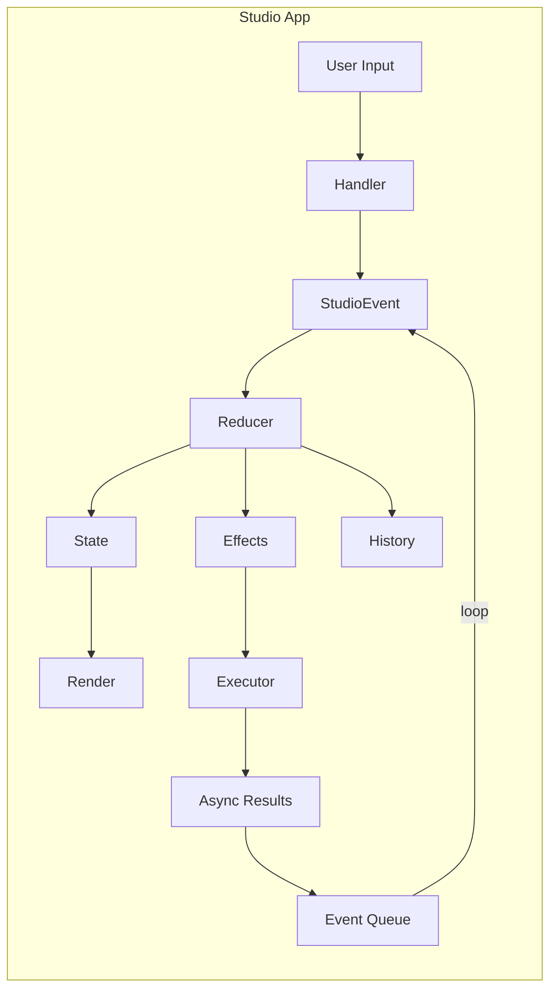

# Studio Internals

**Architectural documentation for developers contributing to Iris Studio.**

Iris Studio is a terminal UI (TUI) built with Ratatui that provides a unified interface for all Git-Iris capabilities. This documentation explains the core architectural patterns, design decisions, and implementation philosophy.

## Philosophy

Studio follows three core principles:

1. **Predictable State Management** — Reducer-centric event flow borrowed from frontend frameworks
2. **Event-Driven Architecture** — All state changes flow through a central event system
3. **Separation of Concerns** — Clear boundaries between state, rendering, and effects

## Architecture Overview



**Data Flow:** User Input → Handler → Event → Reducer → (State, Effects, History) → Render/Execute → Event Queue → loop

### Key Components

| Component      | Location         | Purpose                                            |
| -------------- | ---------------- | -------------------------------------------------- |
| **State**      | `state/mod.rs`   | Single source of truth for all UI state            |
| **Events**     | `events.rs`      | 48 event variants for all state transitions        |
| **Reducer**    | `reducer/`       | Cross-mode state transitions split across 8 files  |
| **Handlers**   | `handlers/`      | Map user input to events and effects               |
| **Components** | `components/`    | Reusable UI widgets with local state               |
| **History**    | `history.rs`     | Complete audit trail, session metadata             |
| **Companion**  | `companion/`     | Ambient awareness — file watcher, branch memory    |
| **App**        | `app/mod.rs`     | Event loop, rendering, effect execution            |

## Why This Architecture?

### The Problem

Interactive TUIs face unique challenges:

- **Async operations** (LLM calls, git operations) mixed with UI updates
- **Complex state** across multiple modes and panels
- **User input** interleaved with agent responses
- **Debugging** — "how did we get here?" when state is inconsistent

### The Solution: Reducer-Centric Event Flow

By centering Studio around a reducer, we get:

1. **Predictability** — Same event + state = same result (testable, debuggable)
2. **Traceability** — Every state change is an event in the history
3. **Separation** — No I/O in state logic, side effects are explicit
4. **Replay** — Can reconstruct any state from event log
5. **Testability** — Reducer paths are easy to exercise directly

### The Trade-off

**Cost:** More indirection. Input → Event → Reducer → Effect → Executor.

**Benefit:** Much clearer state flow for cross-mode work, even though some localized UI updates still happen in handlers and `StudioApp`.

## Core Concepts

### State

**Single source of truth** for the entire application. Located in `state/mod.rs`.

```rust
pub struct StudioState {
    pub repo: Option<Arc<GitRepo>>,
    pub git_status: GitStatus,
    pub git_status_loading: bool,
    pub config: Config,
    pub active_mode: Mode,
    pub focused_panel: PanelId,
    pub modes: ModeStates,           // Per-mode state
    pub modal: Option<Modal>,
    pub chat_state: ChatState,       // Persistent across modes
    pub notifications: VecDeque<Notification>,
    pub iris_status: IrisStatus,
    pub companion: Option<CompanionService>,
    pub companion_display: CompanionSessionDisplay,
    pub dirty: bool,
    pub last_render: Instant,
}
```

**Key characteristics:**

- Owned by `StudioApp`
- Most high-level transitions flow through reducer events, but handlers and `StudioApp` still update some localized UI/data state directly
- Read-only for rendering

### Events

**All state changes are events.** Located in `events.rs`.

```rust
#[derive(Debug, Clone)]
pub enum StudioEvent {
    // User input
    KeyPressed(KeyEvent),
    Mouse(MouseEvent),

    // Navigation
    SwitchMode(Mode),
    FocusPanel(PanelId),
    FocusNext,
    FocusPrev,

    // Content generation
    GenerateCommit { instructions, preset, use_gitmoji, amend },
    ToggleAmendMode,
    GenerateReview { from_ref, to_ref },
    GeneratePR { base_branch, to_ref },
    GenerateChangelog { from_ref, to_ref },
    GenerateReleaseNotes { from_ref, to_ref },
    ChatMessage(String),

    // Agent responses
    AgentStarted { task_type },
    AgentProgress { task_type, tool_name, message },
    AgentComplete { task_type, result },
    AgentError { task_type, error },
    StreamingChunk { task_type, chunk, aggregated },
    StreamingComplete { task_type },
    StatusMessage(StatusMessage),    // Dynamic status from fast model

    // Tool-triggered (agent controls UI)
    UpdateContent { content_type, content },
    LoadData { data_type, from_ref, to_ref },
    StageFile(PathBuf),
    UnstageFile(PathBuf),

    // Git + file logs
    FileStaged(PathBuf), FileUnstaged(PathBuf),
    RefreshGitStatus, GitStatusRefreshed,
    SelectFile(PathBuf),
    FileLogLoaded { file, entries }, FileLogLoading(PathBuf),
    GlobalLogLoaded { entries }, GlobalLogLoading,
    ToggleGlobalLog,

    // Modals + UI
    OpenModal(ModalType), CloseModal,
    ModalConfirmed { modal_type, data },
    Notify { level, message },
    Scroll { direction, amount },
    ToggleEditMode,
    NextMessageVariant, PrevMessageVariant,
    CopyToClipboard(String),

    // Settings
    SetPreset(String), ToggleGitmoji, SetEmoji(String),

    // Lifecycle
    Quit, Tick,

    // Companion (ambient awareness)
    CompanionFileCreated(PathBuf),
    CompanionFileModified(PathBuf),
    CompanionFileDeleted(PathBuf),
    CompanionGitRefChanged,
    CompanionWatcherError(String),
    CompanionBranchSwitch { branch, welcome_message },
}
```

There are 48 variants in total — see `src/studio/events.rs` for the full enum. The derive list is `#[derive(Debug, Clone)]` only; events are not serializable today.

Events come from four sources (the `EventSource` enum):

1. **User** — Keyboard, mouse
2. **Agent** — LLM responses
3. **Tool** — Agent tool calls (when Iris drives the UI)
4. **System** — Tick, refresh, async task completion

### Side Effects

**Effects are data returned by the reducer.** Located in `events.rs`.

The reducer avoids direct I/O, so effects describe operations for the app to execute:

```rust
#[derive(Debug, Clone)]
pub enum SideEffect {
    SpawnAgent { task: AgentTask },
    LoadData { data_type, from_ref, to_ref },
    GitStage(PathBuf), GitUnstage(PathBuf),
    GitStageAll, GitUnstageAll,
    SaveSettings,
    RefreshGitStatus,
    CopyToClipboard(String),
    ExecuteCommit { message },
    ExecuteAmend { message },
    ShowNotification { level, message, duration_ms },
    Redraw,
    Quit,
    GatherBlameAndSpawnAgent { file, start_line, end_line },
    LoadFileLog(PathBuf),
    LoadGlobalLog,
}
```

After the reducer returns, `StudioApp::execute_effects()` performs I/O:

- Spawn async agent tasks
- Execute git commands
- Save config to disk
- Copy to clipboard

### History

**Complete audit trail** of all events, modes, and content. Located in `history.rs`.

```rust
#[derive(Debug, Clone)]
pub struct History {
    pub metadata: SessionMetadata,                    // session_id, timestamps, branch
    events: VecDeque<HistoryEntry>,                   // unified event log
    max_events: usize,                                // capacity bound
    chat_messages: Vec<ChatMessage>,                  // chat across modes
    content_versions: HashMap<ContentKey, Vec<ContentVersion>>,  // per (mode, content_type)
    next_id: u64,
}
```

A `HistoryEntry` carries a timestamp, source, and a `HistoryChange` (one of `Event`, `ContentUpdated`, `ChatMessage`, `ModeSwitch`, `AgentTaskStarted`, `AgentTaskCompleted`). The on-disk shape — `save_to_file`/`load_from_file` and the metadata that supports thread resume — is planned future work; today `History` lives only in memory.

Use cases:

- **Debugging** — "What events led to this state?"
- **Audit trail** — Inspect agent vs. user vs. tool sources
- **Analytics** — Which modes are used most?
- **Versioning** — `latest_content()` and `content_versions()` let you walk back through generated content

## Data Flow Example

Let's trace a commit message generation:

```
1. User presses 'g' in Commit mode
   ↓
2. Handler: handle_commit_key()
   Returns: GenerateCommit { instructions: None, preset: "default", use_gitmoji: true }
   ↓
3. Reducer: reduce()
   - state.modes.commit.generating = true
   - state.iris_status = Thinking { task: "Generating..." }
   - history.record_agent_start(Commit)
   Returns: [SpawnAgent { task: Commit {...} }]
   ↓
4. Executor: execute_effects()
   - Spawns async agent task
   - Task sends progress events via channel
   ↓
5. Agent completes, sends event via channel:
   AgentComplete { task_type: Commit, result: CommitMessages([...]) }
   ↓
6. Event loop receives async result, converts to event
   ↓
7. Reducer: reduce()
   - state.modes.commit.messages.extend(result)
   - state.modes.commit.current_index = first_new_index
   - state.modes.commit.generating = false
   - state.modes.commit.message_editor.add_messages(result)
   - state.iris_status = Complete { message: "Ready." }
   - history.record_agent_complete(Commit, true)
   Returns: []
   ↓
8. Render: render_commit_panel()
   - Displays generated messages in UI
```

**Notice:** No I/O in reducer, state updates are synchronous, async results feed back as events.

## Directory Structure

```
src/studio/
├── state/
│   ├── mod.rs              # StudioState, Mode, PanelId, Modal, IrisStatus, CompanionSessionDisplay
│   ├── chat.rs             # ChatState, ChatMessage, ChatRole
│   └── modes.rs            # ExploreState, CommitState, ReviewState, PrState, ChangelogState, ReleaseNotesState
│
├── events.rs               # StudioEvent, SideEffect, AgentTask/Result, TaskType, ContentType/Payload,
│                           # DataType, ModalType, NotificationLevel, ScrollDirection, EventSource,
│                           # TimestampedEvent, BlameInfo, SemanticBlameResult, ChatContext
│
├── reducer/
│   ├── mod.rs              # reduce() dispatcher, key + mouse plumbing
│   ├── agent.rs            # AgentStarted/Progress/Complete/Error, streaming
│   ├── content.rs          # UpdateContent (tool-driven UI updates), file staging
│   ├── git.rs              # FileStaged/Unstaged, status refresh, file log + global log
│   ├── modal.rs            # create_modal, apply_ref_selection
│   ├── navigation.rs       # apply_scroll across modes and panels
│   ├── settings.rs         # preset, gitmoji, emoji, amend mode toggles
│   └── ui.rs               # notify, scroll wrapper, edit mode, message variant cycling
│
├── handlers/
│   ├── mod.rs              # handle_key_event, handle_global_key (cross-mode dispatch)
│   ├── commit.rs explore.rs review.rs pr.rs changelog.rs release_notes.rs
│   └── modals/             # chat, commit_count, confirm, emoji_selector, instructions, mod,
│                           # preset_selector, ref_selector, search, settings, theme_selector
│
├── components/
│   ├── mod.rs              # Re-exports
│   ├── file_tree.rs        # FileTreeState, TreeNode, FlatEntry, FileGitStatus
│   ├── code_view.rs        # CodeViewState
│   ├── diff_view.rs        # DiffViewState, FileDiff, DiffHunk, DiffLine, DiffLineType, parse_diff
│   ├── message_editor.rs   # MessageEditorState (wraps tui-textarea)
│   └── syntax.rs           # SyntaxHighlighter (syntect → ratatui Style)
│
├── render/
│   ├── mod.rs commit.rs explore.rs review.rs pr.rs changelog.rs release_notes.rs chat.rs
│   └── modals/             # 12 modal renderers: chat_modal, commit_count, confirm,
│                           # emoji_selector, help, instructions, mod, preset_selector,
│                           # ref_selector, search, settings, theme_selector
│
├── app/
│   ├── mod.rs              # StudioApp, event loop, execute_effects, terminal lifecycle
│   └── agent_tasks.rs      # spawn_*_generation helpers
│
├── history.rs              # History, SessionMetadata, HistoryEntry, ContentVersion, ChatMessage
├── layout.rs               # Mode-specific layout configs, LayoutAreas, responsive helpers
├── utils.rs                # truncate_width, truncate_chars, expand_tabs
├── theme.rs                # SilkCircuit palette + semantic style helpers
└── tests/                  # Reducer, history, and component tests

src/companion/              # Wired into StudioState as `companion`
├── mod.rs                  # CompanionService (session + storage + watcher)
├── session.rs              # SessionState, FileActivity
├── branch_memory.rs        # BranchMemory, FileFocus, welcome messages
├── storage.rs              # CompanionStorage (per-repo persistence)
└── watcher.rs              # FileWatcherService → CompanionEvent
```

## Companion: Ambient Awareness

The `companion` subsystem (in `src/companion/`) gives Studio an ambient sense of what's happening in the repository between explicit commands. It's wired into `StudioState` via two fields — `companion: Option<CompanionService>` and `companion_display: CompanionSessionDisplay` — and feeds the reducer through seven `Companion*` events plus a `Tick`-driven welcome-message auto-clear.

| Piece                 | Role                                                                                      |
| --------------------- | ----------------------------------------------------------------------------------------- |
| `CompanionService`    | Coordinates session, storage, and the optional file watcher; per-repo                     |
| `SessionState`        | Files touched, commits made, session duration, current branch                             |
| `BranchMemory`        | Per-branch focus and welcome messages when you return to a branch                         |
| `FileWatcherService`  | Background `notify`-based watcher that emits `CompanionEvent`s                            |
| `CompanionStorage`    | Persists session + branch memory under the repo's git-iris data dir                       |

The reducer translates each `CompanionEvent` into a state update: file touches drive `companion_touch_file` plus `update_companion_display`; `CompanionGitRefChanged` refreshes git status and, when the branch changed, loads `BranchMemory`, records the visit, and stashes a welcome message in `companion_display.welcome_shown_at`. The `Tick` arm clears that welcome message after 30 seconds. If file watching fails to initialize, `companion` stays `Some` but `has_watcher()` returns `false` — Studio still works without ambient updates.

## Next Steps

- **[Reducer Pattern](./reducer.md)** — Deep dive into `reduce()` function
- **[Event System](./events.md)** — Event types and flow
- **[Components](./components.md)** — Reusable UI widgets

## Design Principles

1. **State is sacred** — Most cross-mode mutations flow through the reducer
2. **Events are data** — Traceable through history, replayable in tests (not serializable today)
3. **Effects are explicit** — No hidden I/O in the reducer
4. **Components are dumb** — Rendering plus display state, no business logic
5. **Handlers are thin** — Map input to events and effects, minimal logic

## Common Patterns

### Adding a New Event

1. Add variant to `StudioEvent` in `events.rs`
2. Add match arm in `reduce()` in `reducer/mod.rs`
3. Optionally add handler logic in `handlers/`
4. Update history recording if needed

### Adding a New Mode

1. Add variant to `Mode` enum in `state/mod.rs`
2. Add mode state struct to `modes.rs`
3. Add render function in `render/`
4. Add handler in `handlers/`
5. Add mode switch logic in `reduce()`

### Adding a New Component

1. Create state struct (e.g., `MyComponentState`)
2. Implement rendering logic
3. Add to `components/mod.rs`
4. Use in mode render functions

### Spawning Agent Tasks

1. Create `SideEffect::SpawnAgent { task }`
2. Return from reducer
3. Executor spawns async task
4. Task sends `AgentComplete` event when done
5. Reducer handles completion, updates state

## Testing Strategy

**Reducer functions are pure** → Easy to test:

```rust
#[test]
fn test_switch_mode() {
    let mut state = StudioState::new(config, None);
    let event = StudioEvent::SwitchMode(Mode::Review);
    let effects = reduce(&mut state, event, &mut history);

    assert_eq!(state.active_mode, Mode::Review);
    assert!(effects.iter().any(|e| matches!(e, SideEffect::LoadData { .. })));
}
```

**Components own a small amount of display state** → Test the state transitions directly:

```rust
#[test]
fn test_file_tree_navigation() {
    let paths = vec![PathBuf::from("a.rs"), PathBuf::from("b.rs")];
    let mut tree = FileTreeState::from_paths(&paths, &[]);

    tree.select_next();
    assert_eq!(tree.selected_path(), Some(PathBuf::from("b.rs")));
}
```

## Performance Considerations

**State updates are fast** — Simple struct mutations in reducer.

**Rendering is efficient** — Ratatui's double buffering, only redraw when `dirty` flag is set.

**Effect execution is async** — Git operations and LLM calls happen in background, don't block UI.

**Event queue** — Batches rapid events (e.g., mouse scroll) into single render.

## Debugging

**Event history** — Call `history.events()` to iterate the audit log.

**State inspector** — `dbg!(&state)` in reducer to inspect state.

**Effect logging** — Log every effect execution to trace I/O.

**Dirty flag** — If UI doesn't update, check if `state.dirty` is being set.

## Glossary

| Term          | Meaning                                             |
| ------------- | --------------------------------------------------- |
| **Reducer**   | Pure function: `(state, event) → (state', effects)` |
| **Event**     | Data describing a state transition                  |
| **Effect**    | Data describing an I/O operation                    |
| **Handler**   | Maps user input to events                           |
| **Component** | Reusable UI widget with local state                 |
| **Mode**      | High-level view (Commit, Review, PR, etc.)          |
| **Panel**     | Sub-section of a mode (Left, Center, Right)         |
| **Modal**     | Overlay dialog (Help, Chat, Settings)               |
| **History**   | Audit trail of all events and content               |
